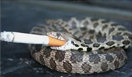
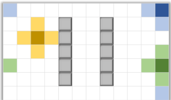
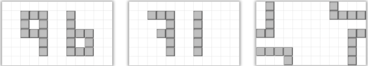
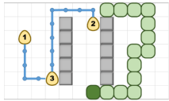

# Snakell 

## Integrantes:
-  Yoan René Ramos Corrales
- Kevin Majim Ortega Álvarez

NOTA: El proyecto dado en su totalidad en Haskell está basado en el proyecto de 1er semestre de 1er Año de Ciencias de la Computación del curso 2019-2020.
  
Sobre un mundo bidimensional de 𝑁 × 𝐾 casillas se han dispuesto un conjunto de obstáculos. Este mundo es
circular por lo que la casilla adyacente a la derecha de una posición en el borde extremo derecho es la
correspondiente en la misma fila pero en el extremo izquierdo, y de esta misma forma con cualquier borde del
terreno. En la imagen siguiente se muestra un mundo válido y algunas casillas con sus adyacentes resaltadas. 
 

 
Todas las casillas “libres” del mundo deben ser alcanzables unas desde otras. La siguiente imagen muestra un
mundo inválido y otros dos válidos. Note que el mundo de la derecha puede llegar a las casillas de los “cuartos”
por la propiedad circular del mundo.

 

En este mundo habita una serpiente glotona que le
gustan los huevos. La serpiente ocupa una secuencia
de casillas adyacentes donde ninguna casilla se
repite. La primera casilla representa la “cabeza” de
la serpiente y la última la cola.

 
La serpiente comienza con una longitud de dos casillas. La serpiente se mueve avanzando la cabeza a alguna
casilla adyacente (que no sea la casilla siguiente de su cuerpo) y moviendo todo su cuerpo hacia la casilla
adyacente correspondiente de forma que se mantenga la integridad física. En el terreno hay depositados en
un principio 𝑄 huevos. La serpiente se “come” un huevo avanzando hacia la casilla donde se encuentra. La
serpiente siempre está moviéndose en determinada dirección a no ser que se le comande cambiar hacia otra
dirección. No tendrá efecto comandarle que cambie hacia la dirección opuesta a la que tiene.
### Reglas:
- Los huevos están enumerados con valores de 1 a 𝑄.
- Cada vez que la serpiente se come un huevo, esta crece en una unidad y el valor del huevo
más cercano se multiplica por 100 para incrementar el puntaje total del juego.
- El concepto de cercanía entre la serpiente y un huevo está dado por la menor secuencia de casillas no
“obstáculos” que separan la cabeza de la serpiente del huevo. Si dos huevos estuvieran a la misma
distancia, el valor del mayor se consideraría para el puntaje. Note que el cuerpo de la serpiente no se
tiene en cuenta como “obstáculo” en el camino.

 
En esta imagen, si la serpiente se comiera el huevo “3”
obtendría solo 100 puntos, puesto que el huevo “2” está más
lejos.
- Cada vez que se eliminen todos los huevos del terreno, otros nuevos 𝑄 huevos aparecen en casillas no
ocupadas del terreno.
- La serpiente no puede “comerse” a sí misma ni comerse un obstáculo. Si esto sucede termina el nivel
con el puntaje que se haya obtenido.
- Si no se pueden ubicar más huevos el nivel termina.
### Aplicación
La aplicación contará con una interfaz visual hecha con el módulo Graphics.Gloss de Haskell y toda su lógica será escrita en Haskell. Se permitirá la creación de niveles describiendo el mundo (sus dimensiones), obstáculos, el parámetro 𝑄 y la velocidad (casillas por segundo). Se permitirá guardar y cargar los niveles creados para jugar y para esto último se usarán las teclas `w` , `a` , `s` , `d`  para cambiar la dirección de la serpiente. 